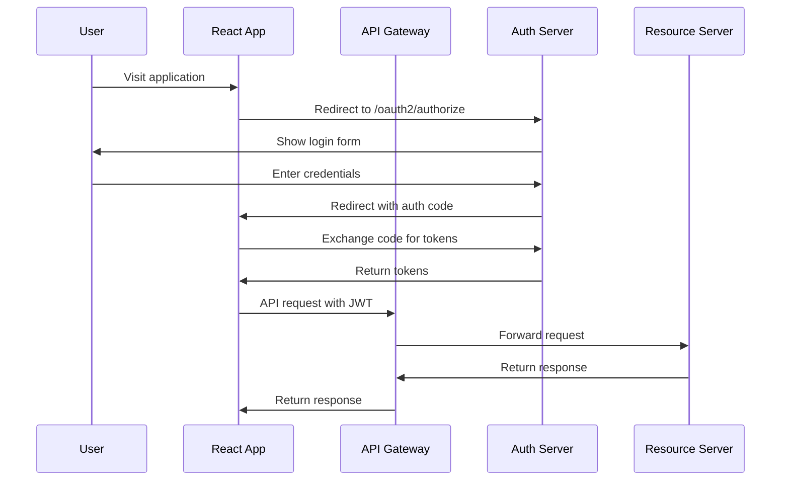

# Modern Application Security: OAuth2/OIDC with JWT Management

A comprehensive demonstration of modern application security patterns, from legacy session-based authentication to OAuth2/OpenID Connect with JWT token management.

## 🎯 Project Overview

This project demonstrates a complete, production-ready OAuth2/OpenID Connect implementation with:

- **OAuth2 Authorization Server** (Spring Authorization Server)
- **Resource Server** (Protected REST APIs)
- **API Gateway** (Request routing and security)
- **React Frontend** (OIDC client implementation)
- **Comprehensive Security Features** (PKCE, JWT, token blacklisting, rate limiting)

## 📚 Educational Content

### Slide 1: Title & Introduction
**Modern Application Security: From Monoliths to OAuth2/OIDC and JWT Management**

This comprehensive guide covers:
- Authentication vs Authorization
- Legacy session-based authentication
- OAuth2 and OpenID Connect
- JWT token management
- Security best practices
- Real-world implementation

### Slide 2: Agenda
1. **AuthN vs AuthZ** - Understanding the difference
2. **Legacy Session-Based Auth** - Traditional approaches
3. **OAuth2/OAuth2 Overview** - Modern delegation protocols
4. **OpenID Connect (OIDC)** - Identity layer on OAuth2
5. **JWT Anatomy & Token Types** - Token structure and usage
6. **Token Lifecycle & Revocation** - Managing token security
7. **Preventing Token Abuse** - Security measures
8. **End-to-End Flow** - Complete implementation
9. **Best Practices & Tooling** - Production recommendations
10. **FAQs & Interview Questions** - Common scenarios

---

## 1. Authentication vs Authorization

### Slide 3: Definitions

**Authentication (AuthN):** Proving identity
- Who are you?
- Username/password, MFA, certificates
- Establishes user identity

**Authorization (AuthZ):** Granting permissions
- What can you do?
- Roles, permissions, policies
- Controls access to resources

### Slide 4: AuthN Methods

| Method | Description | Use Case |
|--------|-------------|----------|
| **Username/Password** | Traditional login | Web applications |
| **MFA (TOTP, SMS, WebAuthn)** | Multi-factor authentication | High-security applications |
| **Certificate-based (mTLS)** | Client certificates | Service-to-service communication |
| **Federated (SAML, OIDC)** | External identity providers | Enterprise applications |

### Slide 5: AuthZ Models

| Model | Description | Example |
|-------|-------------|---------|
| **RBAC** | Role-based access control | User → Admin role → Permissions |
| **ABAC** | Attribute-based access control | User age > 18 → Access to content |
| **PBAC** | Policy-based access control | External policy engine (OPA) |

---

## 2. Legacy Monolith & Session-Based Auth

### Slide 6: Monolith Architecture

```
┌─────────────────────────────────────┐
│           Monolith Application      │
├─────────────────────────────────────┤
│  ┌─────────┐  ┌─────────┐          │
│  │  Auth   │  │  User   │          │
│  │  Logic  │  │  Data   │          │
│  └─────────┘  └─────────┘          │
│  ┌─────────┐  ┌─────────┐          │
│  │ Session │  │  Roles  │          │
│  │ Storage │  │  & Perm │          │
│  └─────────┘  └─────────┘          │
└─────────────────────────────────────┘
```

### Slide 7: Session-Based Flow

```
1. User Login → Create Session Record
2. Issue Session Cookie
3. Every Request → Session Lookup
4. Validate Session → Grant Access
```

### Slide 8: Drawbacks

- **Stateful** – Needs replication/sticky sessions
- **Hard to scale** to microservices or mobile
- **Tight coupling** of auth logic
- **Session storage** overhead
- **Cross-domain** limitations

---

## 3. OAuth & OAuth2

### Slide 9: OAuth 1.0 Recap

- **Delegated access** with signatures
- **Complexity** and limited mobile/SPAs support
- **Signature-based** authentication
- **No refresh tokens**

### Slide 10: OAuth2 Fundamentals

**Bearer tokens over HTTPS**

**Grant Types:**
- **Authorization Code** (w/ PKCE) - Most secure for SPAs
- **Client Credentials** - Machine-to-machine
- **Device Code** - IoT and limited devices
- **~~Implicit~~** - Deprecated (security issues)
- **~~ROPC~~** - Deprecated (password exposure)

### Slide 11: OAuth2 Token Types

| Token Type | Format | Expiry | Use |
|------------|--------|--------|-----|
| **Access Token** | JWT/opaque | 5–15 min | API calls |
| **ID Token** | JWT | ~5–15 min | User identity claims |
| **Refresh Token** | opaque/JWT | days–weeks | Renew access tokens |

---

## 4. OpenID Connect (OIDC)

### Slide 12: Why OIDC?

- **Identity layer** on OAuth2
- **Standardized ID Token** (JWT)
- **UserInfo endpoint** & discovery
- **Standardized claims** and scopes

### Slide 13: OIDC Flow (Auth Code + PKCE)

```
1. /authorize redirect with code_challenge
2. User login & consent
3. Redirect back with code + state
4. /token exchange with code_verifier
5. Receive { id_token, access_token, refresh_token }
```

---

## 5. JWT Anatomy & Token Types

### Slide 14: JWT Structure

```
Header.Payload.Signature
```

**Header:** Algorithm and token type
```json
{
  "alg": "RS256",
  "typ": "JWT",
  "kid": "key-id"
}
```

**Payload:** Claims and data
```json
{
  "sub": "user123",
  "iss": "https://auth.example.com",
  "aud": "api.example.com",
  "exp": 1640995200,
  "iat": 1640991600,
  "jti": "unique-token-id"
}
```

**Signature:** Cryptographic signature
```
RS256(base64UrlEncode(header) + "." + base64UrlEncode(payload), private_key)
```

### Slide 15: Token Comparisons

| Token | Format | Expiry | Use | Security |
|-------|--------|--------|-----|----------|
| **Access** | JWT/opaque | 5–15 min | API calls | Short-lived |
| **ID Token** | JWT | ~5–15 min | User identity | Identity claims |
| **Refresh** | opaque/JWT | days–weeks | Renew access | Long-lived, secure storage |

---

## 6. Token Lifecycle & Revocation

### Slide 16: Short-Lived Access + Refresh

**TTL Strategy:** Minimize window of misuse
- **Access tokens:** 15 minutes
- **Refresh tokens:** 24 hours
- **ID tokens:** 15 minutes

**Refresh Token Rotation:**
- New refresh token issued on each use
- Old refresh token immediately invalidated
- Prevents refresh token reuse attacks

### Slide 17: Session Store & Revocation

```java
@Service
public class TokenBlacklistService {
    public void blacklistToken(String jti, Duration ttl) {
        String key = BLACKLIST_PREFIX + jti;
        redisTemplate.opsForValue().set(key, "revoked", ttl.toSeconds(), TimeUnit.SECONDS);
    }
}
```

### Slide 18: Blacklisting & Versioning

**Revocation Strategies:**
1. **Blacklist lookup** on each API call
2. **Include version claim** in JWT, bump on invalidation
3. **Short TTL** to minimize revocation window
4. **Redis-based** blacklisting for performance

---

## 7. Preventing Token Abuse

### Slide 19: One-Time Refresh Tokens

```java
// Detect reuse → revoke all sessions
if (refreshTokenUsed) {
    revokeAllUserSessions(userId);
    throw new SecurityException("Refresh token reuse detected");
}
```

### Slide 20: Client Binding & Rate-Limit

**Client Binding:**
- Bind refresh token to IP/User-Agent fingerprint
- Validate client characteristics on each use

**Rate Limiting:**
```yaml
- name: RateLimiter
  args:
    redis-rate-limiter.replenishRate: 10
    redis-rate-limiter.burstCapacity: 20
```

---

## 8. End-to-End Real-Time Flow

### Slide 21: User Journey

```
1. User visits SPA → no token → redirect to IdP
2. Login at Auth Server (OIDC)
3. Code exchange → tokens issued
4. SPA stores access/id in memory; refresh in secure cookie
5. SPA calls API → validates JWT via JWKS
6. On expiry → silent refresh with cookie
7. Logout → clear cookie + revoke session
```

### Slide 22: Sequence Diagram



---

## 9. Best Practices & Tooling

### Slide 23: Security Controls Checklist

- ✅ **HTTPS everywhere**, HSTS, secure cookies
- ✅ **Strong password/MFA** requirements
- ✅ **Least privilege** & scope management
- ✅ **CSP, CORS**, security headers
- ✅ **Automated SAST/DAST** in CI/CD
- ✅ **Token rotation** and blacklisting
- ✅ **Rate limiting** and abuse prevention
- ✅ **Monitoring** and alerting

### Slide 24: Free & Open-Source Solutions

| Category | Tool | Description |
|----------|------|-------------|
| **Identity Server** | Keycloak, ORY Hydra | OAuth2/OIDC servers |
| **Auth SDKs** | Authlib (Python), Spring Auth Server | Client libraries |
| **DAST** | OWASP ZAP | Dynamic application security testing |
| **SAST** | SonarQube Community | Static application security testing |
| **Dependency Scan** | OWASP Dependency-Check | Vulnerability scanning |

---

## 10. Frequently Asked Questions

### Q: Why use short-lived JWTs if revocation is hard?
**A:** Short TTL minimizes misuse window; combine with refresh rotation & blacklists.

### Q: Should I store JWTs in localStorage or cookies?
**A:** Use HttpOnly, Secure, SameSite cookies to prevent XSS & CSRF.

### Q: How often should I rotate signing keys?
**A:** At least quarterly or after any suspected compromise; automate via JWKS.

### Q: What's PKCE and why is it needed?
**A:** Proof Key for Code Exchange protects the Authorization Code flow in public clients.

### Q: Can I mix opaque tokens with JWTs?
**A:** Yes—opaque for refresh tokens, JWT for access tokens to keep size down.

### Q: How to handle multi-tenant key management?
**A:** Use separate key pairs per tenant or include kid in JWT header and route via JWKS.

### Q: What's the difference between scopes and roles?
**A:** Scopes are API permissions; roles are higher-level groupings of permissions.

### Q: Is OAuth2 secure for mobile apps?
**A:** Yes, using Authorization Code + PKCE—never use Implicit flow.

### Q: How do I log out a user on all devices?
**A:** Revoke all refresh tokens or bump a global token-version in user record.

### Q: How to monitor token misuse?
**A:** Log auth events centrally, alert on refresh storms or invalid JWT errors.

---

## 11. Interview-Level Questions & Answers

### Q: Explain the OAuth2 Authorization Code flow with PKCE.
**A:** 
1. Client generates `code_verifier` (random string)
2. Client creates `code_challenge` = SHA256(code_verifier)
3. Client redirects to `/authorize` with `code_challenge`
4. User authenticates and authorizes
5. Server redirects with `authorization_code`
6. Client exchanges code + `code_verifier` at `/token`
7. Server validates `code_challenge` matches `code_verifier`
8. Server issues access_token, refresh_token, id_token

### Q: How would you implement immediate JWT revocation?
**A:**
1. Include `jti` (JWT ID) in token claims
2. Store active `jti` values in Redis/DB with TTL
3. On logout, mark `jti` as revoked in Redis
4. API checks `jti` on each request
5. Alternative: Include session version in JWT, bump on logout

### Q: What are the security risks of using localStorage for tokens?
**A:**
- **XSS attacks** can steal tokens
- **No automatic expiration** handling
- **CSRF protection** not built-in
- **Better approach:** HttpOnly cookies with proper flags

### Q: Compare OAuth2's Client Credentials vs. Authorization Code grants.
**A:**
- **Client Credentials:** Machine-to-machine, no user context, direct token issuance
- **Authorization Code:** User-centric, requires user login/consent, returns ID Token

### Q: How do you secure microservices with JWTs and prevent replay attacks?
**A:**
- Use HTTPS everywhere
- Short TTL (5-15 minutes)
- Include `jti` and validate uniqueness
- Use `iat` (issued at) claim
- Implement mutual TLS for service-to-service
- Rotate signing keys regularly

---

## 🏗️ Architecture Overview

```
┌─────────────────┐    ┌─────────────────┐    ┌─────────────────┐
│   React SPA     │    │   API Gateway   │    │  Auth Server    │
│   (Port 3000)   │◄──►│   (Port 8000)   │◄──►│  (Port 9000)    │
└─────────────────┘    └─────────────────┘    └─────────────────┘
                              │
                              ▼
                       ┌─────────────────┐
                       │ Resource Server │
                       │  (Port 8080)    │
                       └─────────────────┘
```

## 🚀 Quick Start

### Prerequisites
- Java 17+
- Node.js 16+
- Redis
- Maven

### 1. Start Backend Services

```bash
# Start Redis
docker run -d -p 6379:6379 redis:alpine

# Start Auth Server
cd auth-server
mvn spring-boot:run

# Start Resource Server
cd resource-server
mvn spring-boot:run

# Start API Gateway
cd api-gateway
mvn spring-boot:run
```

### 2. Start Frontend

```bash
cd frontend
npm install
npm start
```

### 3. Test the Application

1. Visit `http://localhost:3000`
2. Click "Login" to start OAuth2 flow
3. Use demo credentials: `user/password` or `admin/admin`
4. Explore protected API endpoints

## 📁 Project Structure

```
OAuth/
├── auth-server/          # OAuth2 Authorization Server
├── resource-server/      # Protected REST APIs
├── api-gateway/          # API Gateway with routing
├── frontend/             # React OIDC client
└── README.md            # This file
```

## 🔧 Configuration

### Environment Variables
```bash
# Auth Server
AUTH_SERVER_PORT=9000
AUTH_SERVER_ISSUER=http://localhost:9000/auth

# Resource Server
RESOURCE_SERVER_PORT=8080
RESOURCE_SERVER_JWT_ISSUER=http://localhost:9000/auth

# API Gateway
GATEWAY_PORT=8000
GATEWAY_REDIS_HOST=localhost
GATEWAY_REDIS_PORT=6379

# Frontend
REACT_APP_AUTH_SERVER=http://localhost:9000/auth
REACT_APP_API_GATEWAY=http://localhost:8000
```

## 🧪 Testing

### Manual OAuth2 Flow Test
```bash
# 1. Start authorization
curl "http://localhost:9000/auth/oauth2/authorize?response_type=code&client_id=react-client&redirect_uri=http://localhost:3000/callback&scope=openid profile api.read&state=test&code_challenge=test-challenge&code_challenge_method=S256"

# 2. Exchange code for tokens
curl -X POST http://localhost:9000/auth/oauth2/token \
  -H "Content-Type: application/x-www-form-urlencoded" \
  -d "grant_type=authorization_code&client_id=react-client&client_secret=secret&code=YOUR_CODE&redirect_uri=http://localhost:3000/callback&code_verifier=test-verifier"

# 3. Test protected API
curl -H "Authorization: Bearer YOUR_JWT_TOKEN" \
  http://localhost:8000/api/user/profile
```

### Automated Tests
```bash
# Run all tests
mvn test

# Run specific service tests
cd auth-server && mvn test
cd resource-server && mvn test
cd api-gateway && mvn test
```

## 📊 Monitoring

### Health Checks
- Auth Server: `http://localhost:9000/auth/actuator/health`
- Resource Server: `http://localhost:8080/api/actuator/health`
- API Gateway: `http://localhost:8000/actuator/health`

### Metrics
- Prometheus metrics available at `/actuator/prometheus`
- Circuit breaker metrics at `/actuator/metrics`
- Gateway metrics at `/actuator/gateway`

## 🔒 Security Features

### Implemented Security Measures
1. **PKCE** - Proof Key for Code Exchange
2. **JWT Validation** - Complete token validation
3. **Token Blacklisting** - Redis-based revocation
4. **Refresh Token Rotation** - Enhanced security
5. **Rate Limiting** - API abuse prevention
6. **Circuit Breakers** - Graceful degradation
7. **CORS Configuration** - Cross-origin security
8. **HTTPS Enforcement** - Transport security

### Security Headers
```http
Strict-Transport-Security: max-age=31536000; includeSubDomains
Content-Security-Policy: default-src 'self'
X-Frame-Options: DENY
X-Content-Type-Options: nosniff
Referrer-Policy: strict-origin-when-cross-origin
```

## 🚀 Production Deployment

### Security Checklist
- [ ] Use production SSL certificates
- [ ] Configure proper CORS origins
- [ ] Set up monitoring and alerting
- [ ] Implement audit logging
- [ ] Use production database
- [ ] Configure backup procedures
- [ ] Set up CI/CD pipeline
- [ ] Implement rate limiting
- [ ] Configure circuit breakers
- [ ] Set up distributed tracing

### Docker Deployment
```bash
# Build images
docker build -t auth-server ./auth-server
docker build -t resource-server ./resource-server
docker build -t api-gateway ./api-gateway

# Run with docker-compose
docker-compose up -d
```

## 🤝 Contributing

This is an educational project demonstrating modern application security patterns. For production use, consider:

- Using established identity providers (Auth0, Okta, Keycloak)
- Implementing comprehensive audit logging
- Setting up proper monitoring and alerting
- Using production-grade databases
- Implementing proper backup and recovery procedures

## 📄 License

This project is for educational purposes. Feel free to use and modify for learning OAuth2/OIDC implementation patterns.

---

## 📚 Additional Resources

### Documentation
- [OAuth 2.0 RFC 6749](https://tools.ietf.org/html/rfc6749)
- [OpenID Connect Core 1.0](https://openid.net/specs/openid-connect-core-1_0.html)
- [JWT RFC 7519](https://tools.ietf.org/html/rfc7519)
- [PKCE RFC 7636](https://tools.ietf.org/html/rfc7636)

### Tools and Libraries
- [Spring Authorization Server](https://spring.io/projects/spring-authorization-server)
- [Spring Security](https://spring.io/projects/spring-security)
- [React OIDC](https://github.com/authts/react-oidc-context)
- [Keycloak](https://www.keycloak.org/)
- [Auth0](https://auth0.com/)

### Security Resources
- [OWASP OAuth 2.0 Security Cheat Sheet](https://cheatsheetseries.owasp.org/cheatsheets/OAuth_2.0_Cheat_Sheet.html)
- [OAuth 2.0 Security Best Practices](https://tools.ietf.org/html/draft-ietf-oauth-security-topics)
- [JWT Security Best Practices](https://auth0.com/blog/a-look-at-the-latest-draft-for-jwt-bcp/) 